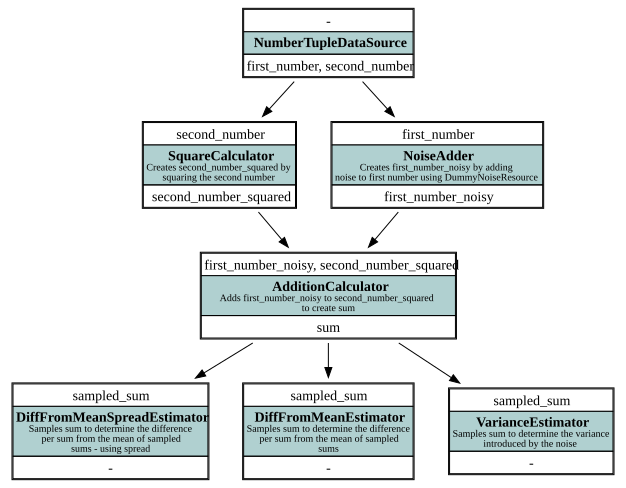
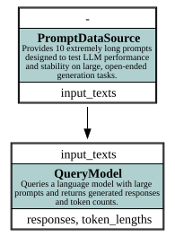

# Examples

The example benchmarks accompanying this framework can be found in the `examples` folder at the root of the project.

## Minimal Working Example

This example demonstrates **async-graph-bench** on a small, self-contained computation graph that can be run on any laptop. It shows how to define a [`DataSource`](./api/datasource.md), connect multiple computation nodes with `requires`/`provides` fields, apply different **sampling modes**, and store results in CSV files. The workflow processes simple number pairs through nodes like `NoiseAdder`, `SquareCalculator`, and `AdditionCalculator`, then computes sampled statistics. The execution graph below visualizes the nodes, their dependencies, and data flow:



## LLM Resource Comparison Example

This example shows how **async-graph-bench** can benchmark large language models (LLMs) across **different providers and configurations**, including online OpenAIAPI Endpoints and local vLLM instances, optionally with multi-GPU setups. A simple data source of prompts feeds a node that queries lengthy responses. Users can compare performance, throughput, and token-level metrics while storing results for later inspection. The execution graph below visualizes nodes, dependencies, and data flow:



The statistics in `benchmark.csv` show the time per generated token for the different providers and configurations.

## LLM Prompt Benchmark Example

This simple example shows how **async-graph-bench** can benchmark LLM prompts for the same task—generating a specified number of random numbers—using multiple iterations and sampling. A small computation graph evaluates two prompt types (comma-separated and numbered lists), extracts the number of generated items, and computes accuracy across iterations. Results are stored in JSON files, and the execution graph visualizes nodes and data flow:


## Prompt for Generating new Benchmarks

In following a prompt is provided that attempts to condense information needed for creating a new benchmark as much as possible. It can be used in combination with an LLM to create a basic blueprint, that may help users take first steps and improve as needed.

```markdown
You are helping to generate a benchmark script using the async-graph-bench framework. In this framework, a benchmark is defined as a directed acyclic graph (DAG) of computation nodes that process data provided by a DataSource. Each node declares which data fields it requires and which fields it provides. The BenchmarkManager automatically constructs the execution graph based on these dependencies and executes all nodes in the correct order. Each item flows through the graph, and intermediate results are cached via DataStores to allow incremental recomputation. Key components to understand:

* DataSource — defines input items for the benchmark.
* Node — encapsulates one computation step.
* DataStore — stores intermediate node outputs for reuse.
* Resource / ResourceBuilder — defines how model or system resources (e.g., LLMs) are instantiated.
* NodeConfig — wraps a node with configuration, data store, and resource bindings.
* BenchmarkManager — orchestrates graph construction, execution, and reporting.

### DataSource

* defines **input items/dataset** for a benchmark
* provides initial values to the computation graph
* unique per benchmark
* Inherits `DataSource`
* attribute `provides: List[str]` — the names of all fields this source outputs
* Implement:
    * `iter_items()` → sync or async generator yielding dicts, each containing:
        * a unique `"id"` (`int`, `str`, or tuple) (**data-driven** for cache stability across reruns)
        * all fields listed in `provides`
    * `iter_ids()` → iterator returning only the ids
    * `__len__()` → total number of items

### Node

**Attributes:**

* `requires` and `provides`: List[str]` — names of dependencies this node requires and provides
* framework builds an execution graph by connecting nodes via matching dependency names
* If `provides` omitted → node is a **leaf node** (its output is stored but not used downstream)

**Computation (`__call__`):**

* Signature: `__call__(item_stats: Dict[str, List]) -> Dict[str, List] | List`
* Nodes process batch of items
* `item_stats` contains one list per required dependency (batch-aligned).
* Return a dict mapping provided dependency names to lists of computed values, on element per item in batch.
* leaf nodes return a dict of arbitrary results (stored only)
* Never modify `item_stats` directly.
* Use `zip` or vectorized operations to compute results across items.
* Default node id = class name, override with a custom `id` attribute or in `NodeConfig`

#### Sampling Nodes

* used to compute aggregate or comparative scores across **iterations of the same item**
* items with the same `id` are grouped into batches of size `sampling_batch_size`
* sampling nodes require dependencies prefixed with `"sampled_"`, e.g. `"sampled_score"`
* `"sampled_"` dependencies are **nested lists**:
  `item_stats["sampled_score"][item][sample_in_batch]`
* sampling nodes must define a `SamplingConfig` in their `NodeConfig`
* three sampling modes:
    * **"first"** — `1 → 1`
        * set `all_variations=False`
        * only the first item in each sampling batch is processed (using all sampled dependencies)
        * ideal when one result represents the whole batch
    * **"extend"** — `m → m`
        * set `all_variations=True`
        * all items in the batch are processed individually, each seeing the full sampled context
        * ideal for per-item scores dependent on other samples
    * **"spread"** — `1 → m`
        * set `spread=True` on the node (not `all_variations`)
        * node runs once per batch and returns, for each provided dependency, a **list of results** (one per item in batch)
        * results are automatically distributed across the batch by the framework

### DataStores

* handle caching and persistence of node results to avoid recomputation
* defined per node via `NodeConfig.data_store`
* implements `to_dataframe()` with columns: `id`, `iter`, and provided dependencies
* available options:
    * `CSVDataStore`, `JSONDataStore` – simple, structured, readable
    * `DiskCacheDataStore` – efficient for large data

### Resources

* configured per node via `NodeConfig.resource_builder`
* resource builder must return a ResourcePool or a list of ResourcePools if multiple resources are required
* resources are provided to node as parameters after first
* environment may be used to share ResourcePools across Nodes

### Models

* GenerationParams similar to VLLM SamplingParameters: max_tokens, logprobs, etc.
* Model query function is wrapper, gives easy access to batch query responses, with:
    * get_assistant_messages -> List[message: str]:
    * get_assistant_tokens -> List[List[token: str]]:
    * get_assistant_logprobs -> List[List[logprob: float]]:
    * get_assistant_tokens_alternatives -> List[List[List[Tuple[token: str, logprob: float]]]]:
* response wrapper cannot be returned directly, use functions for properties per query

### Node Config

**Attributes:**

* `node` — the computation node (implements `Node` protocol)
* `data_store` — callable returning a `DataStore` for result caching
* `resource_builder` — optional function/object for building execution resources
* `batch_size` — number of items processed together per call
* `greedy` — if `True`, node is always executed even if not required downstream
* `always_recompute` — if `True`, clears cached results before run to force recomputation

### Benchmark Manager

* constructs and executes the full computation graph
* run benchmark with `manager.run_benchmark()`
* supports multiple iterations per item (`iterations` parameter)
* collects results and basic statistics via `BenchmarkReport`
* exposes all node stores through `manager.store_per_node` (keyed by node id/class name)

# Example benchmarking script

from async_graph_bench import DataSource, NodeConfig, SamplingConfig, BenchmarkManager, ResourcePool, JSONDataStore, Model, CSVDataStore from async_graph_bench.models import GenerationParameters from async_graph_bench.models.openai_api_model import OpenAIAPIModel

def extract_from_numbered_list(response: str):
return len(re.compile(r"\d+\. \d+").findall(response))

class PromptSource(DataSource):
provides = ["number_items", "prompt", "extractor"]
items = [
{
"id": ("numbered_list", 28),
"number_items": 28,
"prompt": "Output 28 random integers between 1 and 100 in a numbered list.",
"extractor": extract_from_numbered_list },
]

    def __len__(self):
        return len(self.items)

    def iter_ids(self):
        for item in self.items:
            yield item["id"]

    async def iter_items(self):
        for item in self.items:
            yield item

class ResponseGenerator:
requires = ["prompt"]
provides = ["response"]

    def __init__(self):
        self.params = GenerationParameters(max_tokens=400)

    async def __call__(self, item_stats, model: Model):
        res = await model.query(item_stats["prompt"], self.params)
        return {"response": res.get_messages()}

class LengthExtractor:
requires = ["extractor", "response"]
provides = ["length"]

    def __call__(self, item_stats):
        responses = item_stats["response"]
        length = [
            extractor(response)
            for response, extractor
            in zip(item_stats["response"], item_stats["extractor"])
        ]
        return {"length": length}

class SampleLengthCounter:
requires = ["sampled_length", "number_items"]
description = "Counts occurrences of each length across sampled runs and computes accuracy"

    def __call__(self, item_stats):
        samples = item_stats["sampled_length"]
        number_items = item_stats["number_items"]
        counts = [dict(Counter(s)) for s in samples]
        accuracy = [
            c.get(n, 0) / len(s) if len(s) > 0 else 0
            for c, s, n in zip(counts, samples, number_items)
        ]
        return {
            "counts": counts,
            "accuracy": accuracy
        }

if __name__ == "__main__":
data_source = PromptSource()

    def resource_builder(env):
        if not hasattr(env, "main_pool"):
            model = OpenAIAPIModel(
                model_id="provider/model",
                openai_endpoint="https://endpoint.com/v1",
                openai_api_key="api_key"
            )
            env.main_pool = ResourcePool([model])
        return env.main_pool


    nodes = [
        NodeConfig(
            ResponseGenerator(),
            data_store=JSONDataStore,
            resource_builder=resource_builder,
            greedy=True,
        ),
        NodeConfig(LengthExtractor(), greedy=True, data_store=CSVDataStore),
        NodeConfig(
            SampleLengthCounter(),
            always_recompute=True, greedy=True, data_store=CSVDataStore,
            sampling_config=SamplingConfig(sampling_size=iterations)
        )
    ]

    iterations = 10

    man = BenchmarkManager(
        iterations=iterations,
        data_source=data_source,
        nodes=nodes,
        data_storage_path="data",
    )
    man.run_benchmark()
    report = man.get_report()
    print(report.to_table())
    # Post-benchmark
    store = man.store_per_node["SampleLengthCounter"]
    for row in store.iter_items():
        print(
            f"Prompt with id {row['id']}\t provided requested number of random numbers with an accuracy of {row['accuracy'] * 100:.1f}% (Counts={row['counts']})"
        )
```

A task that could follow this context:

```markdown
Now, create a benchmark script for the following scenario:

* **Data source:** cais/mmlu dataset from huggingface, with question: str, choices: List[str], correct_choice_index: int
* **Computation node `QueryAnswer`:** formats each MMLU question as a multiple-choice classification task (A/B/C/D) and prompts the model for an answer
* **Computation node `Extractor`:** provides the models log-probabilities for each choice (list of probabilities), the most likely label index, and whether it matches the correct answer
* **Post-benchmark:** (no node, using present stores) aggregate `is_correct` per item of `Extractor` to compute the overall accuracy across all questions
```