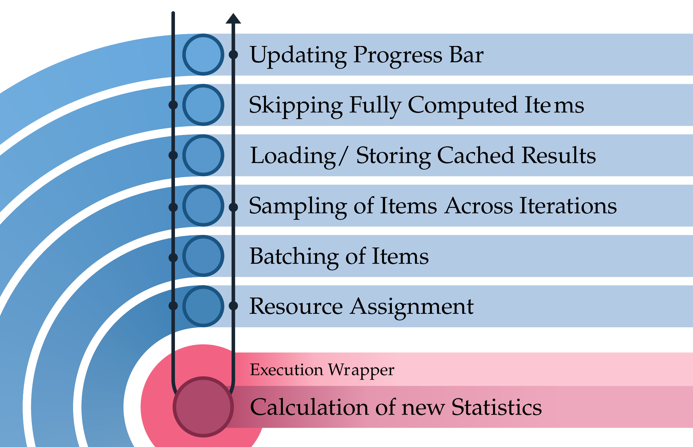

# Node Configuration

A **NodeConfig** is a wrapper around a node that defines how it should behave inside the benchmark graph. While the node itself is responsible for the actual calculation, the NodeConfig enriches it with additional functionality such as caching, batching, sampling, or resource management.

In practice, a NodeConfig determines how the framework schedules, executes, and manages a node’s results. Based on the configuration, the framework will decorate the node with one or more layers that extend its behavior.

## Attributes

Each NodeConfig specifies the following options:

* **`node`**
  The underlying calculation node (must implement the [`Node`](../api/node.md) protocol).

* **`greedy`**
  Marks the node as mandatory for execution. Greedy nodes cannot be skipped during graph construction, and their results must always be computed.

* **`id`**
  Identifier of the node. Defaults to the class name or the node’s own `id` attribute if not explicitly provided.

* **`data_store`**
  A callable returning a
  [`DataStore`](../api/datastore.md) instance for caching results. If present, node outputs will be stored and reused across runs.

* **`batch_size`**
  Defines how many items are provided to the node at once. Enables more efficient vectorized or batched processing.

* **`resource_builder`**
  An optional function or object responsible for creating the execution environment, for example initializing a model, opening a database connection, or allocating GPU resources.

* **`queue_size`**
  The maximum queue size of the node. If the queue is full, predecessor nodes must wait until the node processes items before continuing.

* **`step`**
  The execution step from which the node should become active. Nodes with a higher step number, and all nodes depending on them, remain inactive in earlier steps.

* **`always_recompute`**
  If
  `True`, the node’s cache will be cleared at the start of each benchmark run, forcing all results to be recomputed. Useful for nodes with non-deterministic or context-dependent outputs.

## Layers Applied to Nodes

When a benchmark runs, each node will be conditionally wrapped in several **layers** that extend its behavior. These layers are applied in a fixed order and act like decorators:

* Incoming items first pass through the outermost layer.
* Each layer may transform, cache, or batch the items before passing them inward.
* The innermost layer is the node’s own calculation (`__call__`).
* Results then travel back outward through the same layers, where they may again be transformed, cached, or managed.

> 
> 
> Layers applied to a node, adding utility. Please note that some less important layers have been omitted in this visualization for clarity and readability.

The next sections describe these layers in detail. Items go through these layers in the specified order and in reverse order as they are leaving the node.

### Progress Bar

The **Progress Bar layer** provides live feedback during benchmark execution. It wraps around a node and updates a
`tqdm` progress bar every time an item is emitted.

This layer is only applied under two conditions:

* The node is marked as **greedy**.
* `show_progress_bar=True` is set in the [BenchmarkManager](../api/benchmarkmanager).

Once active, the progress bar increments with each processed item. When the data source signals that no more items are available, the bar is cleanly disabled.

This feature is particularly useful for long-running benchmarks, where it allows users to monitor progress in real time without affecting the calculation itself.

### Handling Multiple Incoming Edges

When a node depends on statistics from multiple upstream nodes that are not in a strict predecessor–successor relationship, the framework must ensure that all required values for a given item are available before continuing.

The **multiple incoming edges layer** handles this case by collecting partial results until every dependency for an item id has been produced. Only once all incoming edges have contributed their values for that item does the layer forward it to the next stage of processing.

This guarantees that downstream nodes always receive complete data, even when their dependencies are computed in parallel or arrive at different times.

### Skipping Fully Computed Items

During a benchmark run, the manager determines which items still require computation. While the data source continues to emit all items that have not yet been fully resolved by the graph, some of them may already have complete results for certain nodes. In such cases, recalculating would be redundant.

The **skipping layer** prevents unnecessary work by filtering out items that have already been fully computed for the current node and is not required by subsequent nodes. When an item is marked as completed in this context, it is intercepted by the layer and not passed further down to the node’s calculation.

This mechanism ensures efficiency in partial or incremental runs, where only a subset of items still needs processing, while previously computed results remain untouched.

### Loading and Storing Cached Results

When a node is configured with a `data_store` in its [`NodeConfig`](../api/nodeconfig.md), the framework applies the **caching layer**. This layer is responsible for loading and storing intermediate or final results, ensuring that nodes do not recompute values that have already been processed.

For each incoming item, the layer first checks whether a result is already available in the configured
[`DataStore`](../api/datastore.md). If a cached result exists, it is merged into the item and immediately emitted, skipping all further processing and calculation for that node. If no cached result is found, the item is passed on to the node’s computation. Once new results are produced, they are stored in the
[`DataStore`](../api/datastore.md) for reuse in future runs.

This mechanism forms the core of the framework’s caching system. By avoiding redundant computation, it makes benchmarks more efficient, allows incremental runs, and enables reuse of results across different benchmark configurations. For details on available storage backends, see [DataStores](../data_stores.md).

### Sampling Layer

The **sampling layer** is applied when a node is configured to process sampled dependencies—typically indicated by dependency keys prefixed with
`"sampled_"`. Its purpose is to group multiple iterations of items together according to the
`sampling_config` so that statistics or aggregated results can be computed over a sample rather than individual items.

Key points:

* **Sample Grouping**: Items are collected per `id` into groups of size
  `sample_size`. Once a group is complete, it is processed.
* **Modes**:
    * `"first"` — only the first iteration in the group gets extended by the sampled dependency and is provided to the node.
    * `"extend"` — all items in a sampling group are extended by the sampled dependency and individually get provided to the node. Sampled dependency get iteratively shifted, so that the individual items have their dependency first in every sampled dependency.
    * `"spread"` — only one item of the group is passed down to the node with the sample distribution, but the node may calculate scores for all iterations. These scores are distributed back to the corresponding original iteration items.

This layer is particularly relevant for nodes that include randomness—like LLM inference or noisy measurements—where statistical aggregation over multiple iterations improves reliability. For a detailed guide and examples, see [sampling](sampling.md).

### Batching Layer

This layer groups incoming items into batches of a specified size before passing them to the node. It is applied when batch_size is set and is particularly useful for nodes that can process multiple items more efficiently at once, such as LLM inference. Any remaining items in the buffer are flushed when an EndOfData signal is received. The implementation ensures that items are safely collected and processed in batches without affecting the order of data flow.

### EndOfData Coordination Layer

This layer will be applied if more than one calculation per node may run in parallel. This may be the case if the node gets provided a pool of more than one resource, allowing it to query multiple resources in parallel. The layer ensures that the EndOfData signal is only passed to the node once all parallel calculations have completed and all resources are idle. This prevents premature termination of processing and ensures that all items are fully processed before signaling completion.

### Resource Assignment

This layer assigns tasks to available resources, such as models or hardware units. It is applied when a resource_builder is specified and ensures that each task uses a resource efficiently. Resources are only created when the first item passes through, avoiding unnecessary allocation. If a node caches results for all items, the resource may never be built, preventing it from occupying hardware unnecessarily. For multiple resources, the layer cycles through them and uses locks to guarantee that each resource is accessed safely and exclusively while processing a task. See the [Resources page](../resources.md) for more information.

### Execution Wrapper

This final layer handles the execution of a node on incoming items. It collects the relevant inputs based on the node's dependencies, runs the node (supporting both synchronous and asynchronous nodes), and merges the results back into the original items. For intermediate nodes, the results are added to the item dictionaries as new statistics. For consumer (leaf) nodes, it emits dictionaries containing the item `id`, iteration index, and computed values, making them ready for caching or final output. If the node returns a simple list instead of a dict, the values are automatically wrapped using the property name defined in `NodeConfig.base_config["prop_name"]`.

## Base Configuration

A base configuration can be set at the start of your script to define default behavior for all [`NodeConfig`](../api/nodeconfig.md) instances. This configuration may include parameters such as the default queue size for processing items or the default property name used when nodes return single-value results. For example:

```python
NodeConfig.base_config = {
    "queue_size": 100,  # Default maximum number of items in a node’s queue
    "prop_name": "estimations"  # Default key used when a node returns a list of values
}
```

These defaults simplify node definitions by providing consistent settings across the entire pipeline.
