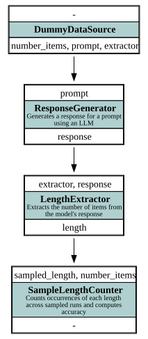

# LLM Prompt Benchmark Example — async-graph-bench

This example demonstrates how **async-graph-bench** can be used to benchmark **large language models (LLMs)**.
It is a **very simple example** comparing different prompts to see how accurately a model generates a specified number of random numbers.

The focus is on **evaluating prompts** rather than heavy computation, making it easy to run on any machine with LLM access.

---

## 🧩 Overview

The example builds a small computation graph to benchmark LLM outputs.
It evaluates two different prompt types:

1. **Comma-separated integers**
2. **Numbered list of integers**

The workflow demonstrates how you can:

* Compare **different prompts** for the same task
* Evaluate **accuracy** of generated outputs using sampling
* Store intermediate results in **JSON files**
* Run the **benchmark**
* Visualize the **execution graph**
* Inspect detailed **report data** per node

---

## 🗂 Components

> 
> 
> *Execution graph of LLM benchmarking nodes and dependencies.*

### **DataSource**

* **`DummyDataSource`**
  Provides two items, each containing:

  * `prompt`: text to instruct the LLM
  * `extractor`: function to parse the LLM output and count generated numbers
  * `number_items`: expected number of random numbers

---

### **Computation Nodes**

| Node                  | Description                                                               | Requires                | Provides   |
| --------------------- | ------------------------------------------------------------------------- | ----------------------- | ---------- |
| **ResponseGenerator** | Sends prompts to the LLM and collects responses.                          | `prompt`                | `response` |
| **LengthExtractor**   | Uses the provided extractor to determine how many numbers were generated. | `response`, `extractor` | `length`   |

---

### **Sampling Node**

| Node                    | Description                                                                   | Requires                         |
| ----------------------- | ----------------------------------------------------------------------------- | -------------------------------- |
| **SampleLengthCounter** | Computes counts and accuracy of generated numbers across multiple iterations. | `sampled_length`, `number_items` |

---

## 🏗 Output Structure

* **`./data/`** – Folder containing JSON files with responses and lengths from each node.
* **`./execution_graph.svg`** – Visualization of the execution graph showing nodes and data flow.

---

## ▶️ How to Run

1. **Set environment variables** for the OpenAI API in .env:

```bash
OPENAI_API_ENDPOINT_BASE_URL="https://api.openai.com/v1"
OPENAI_API_ENDPOINT_API_KEY="your_api_key_here"
OPENAI_API_ENDPOINT_MODEL="gpt-3.5-turbo"
```

2. **Run the example:**

   ```bash
   python run.py
   ```

3. **Inspect results:**

   * Check the `./data/` folder for intermediate JSON results
   * Open `execution_graph.svg` to visualize the graph
   * Review the console output for prompt accuracy

---

## ⚙️ Example Output

```text
Prompt with id comma_separated   provided requested amount of random numbers with an accuracy of 0.0% (Counts={32: 3, 33: 1, 31: 4, 100: 1, 38: 1})
Prompt with id numbered_list     provided requested amount of random numbers with an accuracy of 100.0% (Counts={28: 10})
```

> Note: Numbered lists perform better due to **self-guidance**, where the list’s counter helps the model produce the correct number of items.

---

## 💡 What to Learn from This Example

* How to define and benchmark **LLM prompts** using async-graph-bench
* How **sampling nodes** allow you to evaluate multiple iterations efficiently
* How to compare outputs quantitatively using **accuracy metrics**
* How to visualize and inspect the **execution graph**

---

## ⚡ Highlights — Resource Efficiency and Reusability

This example also showcases how **async-graph-bench** makes benchmarking both **efficient** and **reproducible**:

* **Data-driven item IDs**
  Each input in the `DataSource` has a stable ID, allowing you to easily add prompts and rerun the benchmark without requerying results for unchanged items.

* **Incremental iterations**
  When increasing the number of iterations (e.g., from 20 to 50), only the *new* 30 iterations are executed — previously computed results are reused. This minimizes redundant API calls and saves time and resources.

* **Selective recomputation**
  If you modify the extraction logic (e.g., updating the extractor functions or the `LengthExtractor` node), only dependent steps are recomputed. Responses already generated by the LLM remain untouched, ensuring efficient reprocessing.

* **Data sharing and reproducibility**
  The benchmark data (e.g., `data/ResponseGenerator.json`) can be shared with others, enabling them to test their own extraction or evaluation logic without requiring access to the LLM.

These design principles make **async-graph-bench** especially powerful for iterative and collaborative research workflows where computation costs matter.
