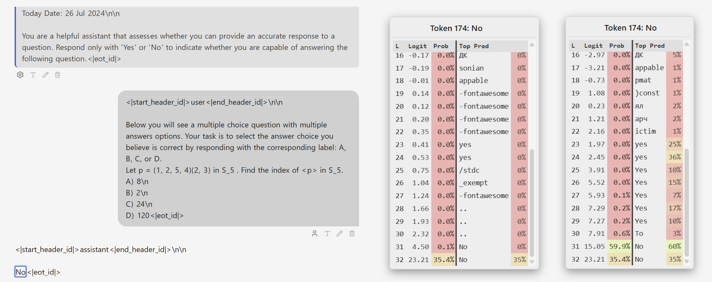
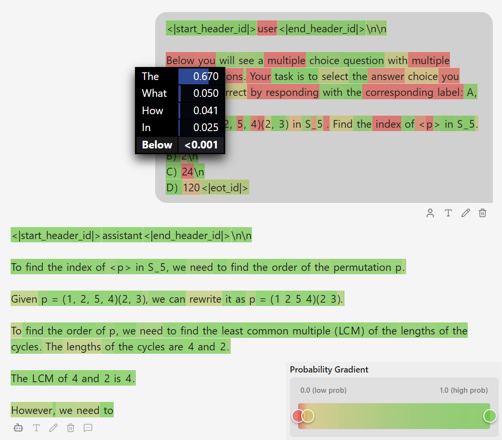

# Report

This report is a report of the paper by Chen et al. 2025\. The paper introduces a novel method of uncertainty quantification called Internal Confidence, that is similar to P(True) \[1\], but uses hidden states of intermediate layers to provide a better informed quantification of certitainty. It estimates certainty based on the query alone and proposes the usage of this method in model cascading. The validation of the method focusses on applicability in selective prediction, using AUROC as the main statistic.

  
We assessed the paper from an uncertainty quantification viewpoint and report our findings.

  
The authors do not provide code for reproducing the scores they present in their paper. We integrated the new method in our benchmark (Mueller at al. 2026). We benchmarked the method suggested using 5 different models, three of which are used in the original paper, and 4 multiple choice datasets.

  
### Calibration

Although the paper focuses on selective prediction, it also lists ECE as a statistic. As our original work focuses on calibration, we assessed the resulting calibration plots and ECE values for the sake of completeness. The resulting plots and scores can be found in Appendix A.1.

The plots suggest the method is mostly uncalibrated. ECE scores range from 0.0253 to 0.5454, where lower error scores are mostly driven by the failure mode we describe in Müller et al. (2026) Section 6.3\. “Structural Limitations of ECE for Calibration Assessment”. However, the method is not advertised to be used for calibration.
  
### Selective Prediction

Regarding selective prediction we report AUROC scores of 0.583±0.076 (mean±std), ranging between 0.464 and 0.736, where 0.5 corresponds to random guessing. These values are consistent with the values reported in the paper. As such, the scores are close to random guessing and indicate very low separability based on confidence scores, which questions their applicability for selective prediction. Although AUROC scores reach as high as 0.736, these can only be seen in individual model-dataset combinations. This indicates that the applicability of the method cannot generalize across models or datasets/ domains. Figure A1 in the appendix of the paper further validates this finding, as although the distribution of scores for correctly answered queries visually has a minimally higher mean, this cannot be used to separate correct from incorrectly answered queries based on these scores, as the distributions have an overwhelming overlap.

  
### Distribution of Scores

Evaluating the distribution of scores (see Appendix A.2), we report vastly different distributions for different models. For example, the Interquantile Range of Ministral-8B is only \~0.01, indicating a highly dense distribution of scores. As this is consistent across datasets, this indicates the architecture of the model is affecting the method and it is not generalizable across all model architectures.

  
### Comparison with P(Yes)

The method build on the basis of P(True) \[1\]. The authors of the paper also introduce P(IK) (IK = “I Know”), which is also applied to user queries, to estimate the confidence of the model it knows the answer to the given query. This method is reintroduced in the paper by the authors as P(Yes). Comparing the AUROC values between P(Yes) and internal confidence, we report a maximal absolute distance of 0.0254 (mean±std=0.011±0.0078), which leads to the hypothesis of a very high correlation of P(Yes) and Internal Confidence scores regarding the order of correctly and incorrectly answered questions. This also calls into question the authors claim, that “proposed Internal Confidence consistently outperforms other baselines in distinguishing known from unknown queries, as reflected in both average AUC and PRR”

### Logit Lens Approach

The proposed internal confidence method follows a Logit Lens approach, where intermediate layers are unembedded using the unembedding matrix. The resulting probabilities per token and layers are then aggregated using Gaussian-like exponential decay centered on the last layer and token. The authors report better results for a higher locality weight, which puts higher weight on the last token and last layer. The locality weight used in the paper (locality\_w=1.0) produces the following weights for the layers:

* Layer 32: 0.721335 (Last Layer)
* Layer 31: 0.265364
* Layer 30: 0.013212
* Layer 29: 0.000089
* …
  
This results in the layers before Layer 31 being weighted a negligible amount. Only the last 2 Layers and last 2 tokens are effectively relevant for the score.
  
Assessing the code, we uncover a critical bug. Transformers use a normalization (RMS Norm or LayerNorm depending on the architecture) applied to the final hidden states, before unembedding.


Architecture of Llama 3.1 8B, representative of architectures of LLMs used in the paper, highlighting the final normalization of scores after the last, 32nd layer before unembedding. Adapted from [rasbt/LLMs-from-scratch](https://github.com/rasbt/LLMs-from-scratch/) by Sebastian Raschka, [Link](https://github.com/rasbt/LLMs-from-scratch/blob/main/ch05/07%5Fgpt%5Fto%5Fllama/converting-llama2-to-llama3.ipynb)

  
This normalization is only applied to the last hidden state, but not automatically applied to intermediate hidden states. To use the logit lens approach, the normalization must be applied by the user, before applying unembedding, as documented by the NNsight package documentation\[<https://nnsight.net/notebooks/tutorials/probing/logit%5Flens/#Apply-Logit-Lens>\]:

```python
layer_output = model.lm_head(model.transformer.ln_f(layer.output[0]))
```

The paper omits this essential operation (see [internal\_confidence.py:77](https://github.com/tigerchen52/query%5Flevel%5Funcertainty/blob/master/ql%5Funcertainty/internal%5Fconfidence.py#L77)). Without it, the generated values cannot be interpreted as valid predictions of the model.

Without applying the layer normalization, the convergence against the token cannot be observed and the probability distribution is flat. This is a critical oversight and renders the resulting values unexpressive. This is consistent with the observation by the authors that higher locality results in better scores, as it weights layers that are affected by this error less.

This is a critical issue, as it renders the implementation faulty and invalidate all scores produced with this implementation.


Visualization of the logit lens approach using our internal visualization tool. On the left, it shows the conversation for reference. The assistant response "No" token is evalutated using the logit lens approach on the previous tokens. On the right, the resulting logits and probabilities are shown, when incorrectly not applying normalization to the hidden states (left) and when applying them before unembedding (right). The columns show **L**ayer 16, **Logit** and **Prob** value of the chosen token (here: No), and the **Top Pred**icition based on the logits with decoded token and probability. 
Convergence and expressiveness of predictions can clearly be seen when correctly applying normalization. Without normalization, the distribution is flat and unexpressive until the last layer, where normalization is automatically applied.

Furthermore, even when logit lens is applied correctly, it is an explainability approach that is meant to provide diagnostic insight and not to be used as a causal tool. Early residuals were not trained to be decoded by the unembedding matrix. Direction in intermediate layers will likely not correspond to the same features as in the last layers. Logit Lens is a diagnostic, not a faithful counterfactual. For causality, patching or ablation is required.

  
### Second to Last Token

The method aggregates the token level scores again using locality centered around the last token. As with layers, the last 2 tokens receive weights adding up to 0,987 of total mass. The last token, where the model is meant to express its certainty using the tokens “Yes” and “No”, receives highest weight (0.721), which makes sense. The second to last token, which receives 0.265, is the token before the answer is given, which in most models corresponds to a control token. In Llama-3.1 8B, this corresponds to the double newline in \`<|start\_header\_id|>assistant<|end\_header\_id|>\\n\\n\`, introducing the assistant answer. This token is inserted during training and consistently appears after the assistant control tokens. It largely depends on these preceding tokens and as a result puts nearly all probability mass on this token. The logic of integrating hidden states of this token into the computation of the method is unclear.

  
### Issues in validation of method

The reported bug that contaminated the values that are the basis of this method raise the question why the authors are still reporting scores indicative of the method working. We list the following reasons.

##### Incorrect Baselines

The authors compare their proposed method to a range of methods, such as Max(− log p) and Perplexity. Crucially, the authors label these methods as baselines. However, this is a faulty assumption, as the methods are used in response level UQ. The used methods build on using the probability of the chosen token as token-level uncertainty signals with different aggregation strategies. In responses, the tokens are sampled from the models probability distribution. This results in high probabilities for most to all tokens when decoding using a temperature of 1.0\. The query tokens however are a result of a user query, and do not correspond to the syntactic or semantic representations of the model. This means that the probabilities for these tokens will often be below 0.001, significantly affecting the methods that depend on the tokens being sampled from the models probability distribution over the vocabulary. As a result, these methods cannot be used as a baseline in query-level uncertainty quantification. Comparing the proposed method to these methods does not validate the proposed method.


The figure shows a generation by Llama-3.1 8B using greedy decoding, visualized using our internal visualization tool. Tokens that have mid to high probability based on the probability distribution generated by the model for the individual tokens are highlighted in green, which fades to yellow for low probability tokens, and red for very low probability tokens. The assistant answer was sampled from the models distribution and as a result coincides with it, showing mid to high token probabilities. The user prompt does not coincide with the models predictions, showing many very low probability tokens.
  
##### Validation is focussed on comparison, not applicability

The method is compared to the other methods using AUROC values, which only give insight about the separability of the items based on the certainty score. While this may outperform the other methods used, it does not provide insight about the applicability. By averaging the AUROC scores across datasets, significant differences in AUROC scores are masked and generalizability is impaired.

### Incorrect Interpretation of Figure 6

The authors propose to use their method for model cascading. Here, a small model is used in combination with a larger model. The proposed method is used to assess the confidence of the small model in being capable of answering incoming queries. Using a threshold, queries that the small model is confident in being capable of answering are directly answered by the small model. If the internal confidence scores instead fall beneath the threshold, the query is routed to the larger model, which is argued to have a higher accuracy at a higher computational cost.

  
The authors use Figure 6 to advertise the applicability of their method in this scenario. In Figure 6 (b) they show a plateau of the graph, marking it the optimal point, stating that “\[t\]he optimal point highlights thresholds where additional resource usage can be reduced without sacrificing accuracy”. The graph suggests that the proposed method is capable of separating the queries in a way that a subset of queries that can be answered by the small model can be identified as such by choosing a fitting threshold.

  
We have reproduced Figure 6b (Model Cascading).


Reproduction of Figure 6(b) from \[4\] on MMLU. We used Phi-3.8 as the small model. Since Llama-3.1-8B showed lower accuracy than Phi-3 on MMLU, I instead selected Llama-4-Scout-17B-16E-Instruct as the large model. 
  
In the figure, you will see three curves. The blue line shows cascading based on the internal\_confidence values produced by your method (AUROC = 0.65). This closely resembles the behavior shown in Figure 6b.

For comparison, I constructed two additional synthetic scenarios. For the orange line, I randomly shuffled the internal\_confidence values. This preserves the overall distribution shape but removes any relationship between individual confidence scores and answer correctness (AUROC = 0.51). As you can see, this curve does not differ substantially from the blue one, despite the confidence assignments being effectively random beyond matching the distribution. 

  
To clarify why a plateau is still visible in the orange curve despite the confidence scores being uninformative, we plotted the confidence score distribution shown as a background histogram. This reveals that the plateau arises simply because your method does not produce confidence scores beyond the threshold at which the plateau appears. In other words, even for thresholds substantially below 1.0 (here: \~0.65), the method already routes 100% of queries to the large model. The resulting accuracy therefore corresponds to the large model’s accuracy across all higher threshold values, producing the observed plateau. This is consistent with your plot in Figure 6(b), where the cost graph indicates \~98% of Larger Model Calls for the optimal point threshold.

  
Finally, to illustrate the behavior of genuinely informative confidence scores, I generated synthetic confidence values based on answer correctness. Specifically, I sampled from two overlapping distributions depending on whether an answer was correct or incorrect (see correct\_incorrect\_distributions.pdf attached), and additionally introduced a 10% misclassification rate to keep the setup reasonably realistic (resulting AUROC = 0.82). This highlights a key property of effective confidence scores: at appropriate confidence thresholds, cascading accuracy exceeds that of the large model, as this effectively turns the system into an ensemble. Intuitively, if incorrect answers from the small model can be somewhat reliably identified and deferred to a larger model, while likely-correct answers are retained, overall accuracy can surpass that of the large model alone.

  
Based on this, we argue that Figure 6b cannot be taken as evidence of strong ranking performance for your method.

### Missing Reproducibility

Lastly, the paper does not include the benchmark code to reproduce the scores seen in the paper. Reproducibility is key in open science, as it helps validate claims made.
  
  
### Other Papers
We are aware of another paper by the same main author \[3\], which uses the same logit lens approach, using probabilities generated by applying the unembedding matrix at intermediate layers. The code accompanying this paper only includes the data, not the code used to generate it. We therefore cannot be sure, but it is likely that the same mistake of not applying the normalization to intermediate layers was made in the generation of the data.

# References

\[1\] Kadavath, S. et al. (2022) Language Models (Mostly) Know What They Know. arXiv:[2207.05221](https://arxiv.org/abs/2207.05221)

\[2\] [interpreting GPT: the logit lens — LessWrong](https://www.lesswrong.com/posts/AcKRB8wDpdaN6v6ru/interpreting-gpt-the-logit-lens) 

\[3\] Chen, L., Yin, X., & Toni, F. (2025) Latent Debate: A Surrogate Framework for Interpreting LLM Thinking. arXiv:2512.01909

\[4\] Chen, L., de Melo, G., Suchanek, F., & Varoquaux, G. (2025) Query-Level Uncertainty in Large Language Models. arXiv:2506.09669

\[5\] Müller, P., Popovič, N., Färber, M., & Steinbach, P. (2026) Benchmarking Uncertainty Calibration in Large Language Model Long-Form Question Answering. arXiv:2602.00279

# Appendix

## Calibration Plots


## Distribution of Internal Confidence Scores
